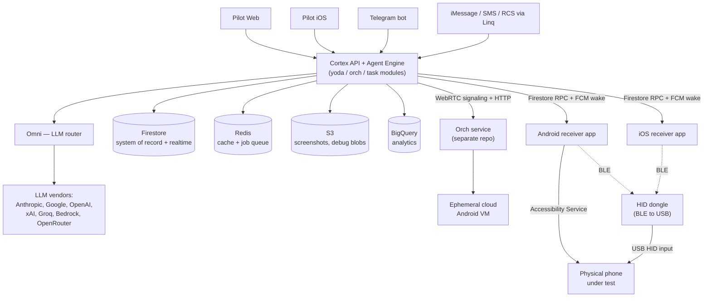

# 02 — High-Level Architecture

*Phase 1 · Document 2 of 4. Assumes you've read [01_project_overview.md](01_project_overview.md).*

This document maps how the pieces physically connect: what talks to what, over which protocol,
storing data where. Document 3 then walks through one task's journey across this map in full
detail. Read this one for the map; read that one for the trip.

## System diagram

Four intake surfaces feed one backend. That backend fans out over one of two structurally
different paths depending on the device: a **cloud phone** (no hardware, direct network access)
or a **paired physical device** (a consumer phone that sleeps, backgrounds, and sits behind
whatever network it's on).

## Cortex: the backend

`cortex/` is a single Node/TypeScript service. One running process does two jobs at once: it's
the Fastify HTTP API server, *and* it's the background job worker (more on why that's a
deployment-relevant fact below). It owns essentially all product logic — there's no separate
"agent service" or "task service"; it's one deployable unit organized internally into
short-prefixed modules.

**Module naming convention worth internalizing**: every module has a 2–4 letter prefix (`task`,
`rcvr`, `yoda`, `mreg`, ...), and by convention its HTTP routes look like
`/cortex/api/<prefix>/v1/<prefix><Action>` — e.g. `/cortex/api/task/v1/taskCreate`. Nearly
everything is `POST`, including reads and lists. Every handler returns a consistent envelope,
`{status, ...}`, where `status` is one shared enum (`AtStatus`) with ~40 values — beyond the
obvious `Success`/`Failure`, values like `FailureTryAgain`, `FailureUnderMaintenance`,
`FailurePilotVersionConflict`, and `FailureTokenExpired` show up in real client error handling, so
"what `status` came back" is often more informative than the HTTP code alone.

A few module names are **not** what they sound like — worth flagging up front so you don't chase
the wrong file:

| If you're looking for... | You might guess | It's actually in |
|---|---|---|
| Device action execution/dispatch | `act/` | `android/` (`act/` is an unrelated marketing-email/onboarding-nudge module) |
| Agent tool schemas | `tools/` | `yoda/yodaTools.ts` (`tools/` is unrelated CLI/support scripts) |
| A registry of "apps Airtap knows how to use" | `app/` | Not a thing — `app/` is device/app-level *operations* (launch, check login state, install by name) |
| A Pub/Sub subscriber | `subscriber/` | Not a thing — `subscriber/` is the marketing waitlist sign-up form |

### Module map

The full module list, grouped by what a QA engineer actually cares about:

**The agent core** (detailed in [03](03_request_lifecycle.md)):
| Module | Responsibility |
|---|---|
| `yoda` | The agent's decision loop: builds prompts, calls the LLM, interprets the result. |
| `orch` | Client wrapper for the external **orch** service that manages cloud Android VMs (that service itself lives outside this repo). |
| `task` | The task entity, its state machine, message handling, and task-related routes. |
| `android` | Executes agent-chosen actions against a device and holds Android-specific tool logic. |
| `omni` | Vendor-agnostic LLM abstraction — one contract for calling any of 7 LLM providers. |
| `mreg` | Model registry: which model powers which purpose, its pricing, and its coordinate system. |
| `umem` | Per-user agent memory, persisted across tasks. |
| `skills` | Domain playbooks the agent can load mid-task. |
| `templates` | Prompt/playbook template files. |
| `rtn` | Routines: scheduling, RRULE handling, recurring execution. |

**Platform & data**:
| Module | Responsibility |
|---|---|
| `srv` | Fastify server setup, route registration, centralized error mapping. |
| `rcvr` | Receiver (device) registration, pairing, the device RPC protocol, WebRTC signaling proxy for cloud phones. |
| `auth` | User session authentication (delegates to an external auth service). |
| `user` | Account data: permissions, usage plans/credits, personal access tokens, admission status. |
| `conf` | Configuration access — both static and live (see below). |
| `ddb` | The Firestore data-access wrapper — Firestore is the real primary datastore. |
| `mdb` / `mdbMgr` | Redis cache wrapper and connection lifecycle management. |
| `fcm` | Push notification delivery (used heavily to wake sleeping receiver devices). |
| `jq` | Background job queue (BullMQ on Redis). |
| `img` | Screenshot/image capture and storage helpers. |
| `app` | Device/app-level operations API (launch app, check login state, install by package name). |
| `at` | Shared response envelope and status/error types used by *every* handler — not a route domain of its own. |

**Observability, evaluation, and integrations** (detailed further below):
| Module | Responsibility |
|---|---|
| `eval` | On-demand AI-quality regression testing. |
| `dash` | Internal analytics dashboards (BigQuery-backed). |
| `stats` | Product event publishing to Pub/Sub. |
| `log` | Centralized logging. |
| `check` | Liveness/health-check endpoints. |
| `tg` | Telegram bot integration (alternate task-intake channel). |
| `linq` | iMessage/SMS/RCS integration (another alternate task-intake channel). |
| `supp` | Zendesk support-ticket creation. |
| `serp` | Web-search tool the agent can call. |
| `ig` | Instagram research tool. |
| `stt` | Speech-to-text (voice task input). |
| `alrm` | Internal alerting (e.g., pages the team on database failures). |
| `act` | Marketing onboarding-nudge emails — **not** device actions, despite the name. |
| `adm` | Admin operational actions backing internal console screens. |

### Omni: talking to seven LLM vendors as one

`omni` exists so the rest of the backend never has to know which LLM vendor is in play. It
defines one canonical request/response shape — messages, a single-tool-call-per-turn contract,
normalized reasoning/text/tool-use output, normalized token/cost stats, a normalized error
taxonomy — and per-vendor "adapter" files translate to and from Anthropic, Google Gemini, OpenAI,
xAI, Groq, OpenRouter, and AWS Bedrock. Two consequences worth knowing:

- **Every** call through Omni can be captured for tracing/debugging (see Observability below) —
  this is what makes "replay exactly what the AI saw and decided" possible after the fact.
- Feature support genuinely varies by vendor (e.g., which providers support native "extended
  thinking" replay, multimodal tool results, etc.) — if a bug seems specific to "when the task
  used model X but not model Y," that's a real, expected axis of variation, not a red flag by
  itself.

### Data stores

| Store | Used for |
|---|---|
| **Firestore** | The system of record: users, tasks, receivers, routines, config. Also doubles as the realtime transport for both device commands and browser UI updates (see below). |
| **Redis** | Response caching, plus the backing store for the background job queue. |
| **S3** | Blob storage — screenshots, gzip-compressed per-call LLM debug payloads, eval datasets, task-analysis output. Namespaced per environment. |
| **BigQuery** | The analytics warehouse behind internal dashboards, fed by Pub/Sub event publishing. |

### Configuration: two tiers with very different behavior

This is a distinction worth internalizing, because it changes what "did my config change take
effect" means:

- **Static env config** (`CORTEX_*` variables) — read once per process at boot. Changing it
  requires a redeploy/restart.
- **Live config** (`ConfSubEnv`, a single Firestore document) — loaded at boot *and* kept
  live-updated via a Firestore listener in every running process. This includes things like model
  routing defaults, per-day credit limits, the minimum supported receiver app version, and various
  feature toggles. **These take effect immediately across every running instance, with no
  deploy.** If a teammate says "I just changed the minimum receiver version" or "I just adjusted
  the daily credit limit," expect it to be live within moments — which also means it's a real,
  fast way to accidentally lock out or throttle every user in an environment.

## Client apps

**Pilot (web)** and **Pilot iOS** are independent codebases that converge on the same backend
contract and the same realtime pattern, which is worth understanding once since it explains a lot
of client behavior:

- The client opens a lightweight Firestore listener on a per-task and per-user "ping" document
  (just an event name + an incrementing update ID — no task content in it).
- When that ping changes, the client does a normal REST call to fetch the actual task details.

In other words: **Firestore tells the client "something changed," REST tells it what.** This means
a client that's lost its Firestore connection (offline, or serving from Firestore's local cache)
can silently fall behind — both apps detect this "serving from cache" condition and surface a
degraded-live-update indicator rather than pretending everything is current.

Beyond that shared pattern:
- **Pilot (web)** is the fullest-featured surface: task composer (text/image/voice), the live task
  thread, device pairing, routines, and (permission-gated) the internal dashboard, evals console,
  and admission console.
- **Pilot iOS** ("PocketPilot.ai") mirrors the consumer-facing parts of web (tasks, routines,
  settings) and adds something web can't: an opt-in mode where **the iPhone running Pilot becomes
  a controllable receiver itself** (an `iosDongle` receiver), turning one app into both controller
  and controllable device depending on how it's configured. When that mode is active, the
  always-running command loop lives inside an iOS ReplayKit broadcast extension process rather
  than the main app — the same architectural pattern used by the standalone `receiver-ios` app
  (see below), because that's what lets iOS keep the automation loop alive while the phone's
  screen is being captured.

## The device layer: how commands actually reach a phone

There are three distinct ways a "receiver" can exist, and they use genuinely different transport
mechanisms:

### 1. Cloud phone — no hardware at all

An ephemeral, cloud-hosted Android virtual machine, provisioned and managed by a separate **orch**
service (outside this repository; cortex only holds a thin client for it). Two channels run in
parallel:
- **Commands**: plain HTTP calls from cortex to a lightweight agent running inside the VM.
- **Live view**: WebRTC. Cortex's role here is purely as a **signaling relay** — it shuttles the
  SDP offer/answer and ICE candidates between the user's browser and the orch-managed instance;
  the actual audio/video/data never passes through cortex.

This is the lowest-friction option for a user (nothing to plug in) and the one with the tightest
network coupling (it needs a live, low-latency connection and idles out after a fixed period of
inactivity).

### 2. Paired physical device (Android or iOS) — Firestore-mediated RPC

Physical phones are consumer devices: they lock, they background, they sleep, and cortex cannot
open a direct connection to them. So paired devices use a different mechanism entirely, built on
Firestore:

- Every receiver has exactly two fixed documents: `rpc/request` and `rpc/response`. Sending a
  command **overwrites** `rpc/request`; the reply **overwrites** `rpc/response`. This is a
  single-slot mailbox, not a queue.
- Cortex attaches a listener to `rpc/response` *before* writing `rpc/request` (so a fast reply
  can't be missed), then waits (30s default timeout) for a response whose IDs match what it sent.
- The device-side app holds the mirror image of this: a long-lived Firestore listener on
  `rpc/request`, executes the command, writes to `rpc/response`.
- Because a backgrounded phone may not have an active listener, task creation **also** fires an
  independent FCM push to wake the device — sent in parallel, unsynchronized, best-effort (not
  retried through any queue). A slow-to-wake phone is a legitimate, expected source of latency or
  timeout here, not necessarily a bug.
- Results — including the screenshot itself — travel back as inline JSON in the response document
  (a screenshot is a base64 string inside `rpc/response.result`). There is no chunking for this
  path, which places a practical ceiling on payload size.
- Firestore security rules enforce the trust boundary precisely: a paired device can read
  `rpc/request` and write `rpc/response` under *its own* receiver document, nothing else. It
  cannot read the response it just wrote, and it cannot touch any other receiver's data.

Once a command reaches the device, execution itself splits again by platform:
- **Android** supports *both* execution paths in one app build: an **Accessibility Service** that
  drives taps/text programmatically, or the **HID dongle**. Which one is active depends on the
  paired receiver type (`physical` vs `androidDongle`).
- **iOS has no accessibility-injection equivalent**, so the dongle isn't optional there — every
  `iosDongle` receiver requires the physical dongle, plus AssistiveTouch enabled in iOS settings
  (iOS only accepts pointer/touch input from an external HID device when AssistiveTouch is on).

### 3. The HID dongle — hardware in the loop

A small BLE-to-USB accessory. The receiver app (Android or iOS) connects to it over **Bluetooth
LE** as the BLE *central*; the dongle itself plugs into the target phone over **USB** and presents
itself to that phone's OS as a standard HID device — a keyboard, a mouse, and a touch digitizer.
Concretely: wireless command in, real hardware signal out. Because this is real hardware, it has
real hardware failure modes with no software analog: BLE range, dead coin-cell/battery, a loose
USB connection, and **firmware version drift** — the dongle's firmware can be out of date relative
to what the receiver app expects, which both receiver apps detect and can remediate with an
over-the-air firmware update (itself a multi-step process that can be interrupted).

### Version compatibility, as a first-class concept

Every device RPC command carries a `minSupportedReceiverVersion`. That floor is one of the *live*
config values described above — it can be raised instantly, in production, without a receiver app
release. The receiver app's actual version, by contrast, is a hardcoded value baked in at build
time. These are two independently maintained numbers. Nothing in the system enforces that they
stay in sync — which makes "did someone raise the version floor ahead of a receiver app rollout"
a real, reproducible way to lock out otherwise-healthy devices, and a good deliberate test in a
non-production environment.

## Alternate task-intake channels

Two integrations let a task be created and driven **entirely by text message**, outside Pilot:

- **Telegram** — a bot with a webhook (not polling). Users link their account once; after that,
  `/new <task>` starts a task, plain messages continue it, `/stop` cancels it, and the bot replies
  when the task finishes or needs input.
- **Linq** (iMessage / SMS / RCS) — the same idea over a texting integration, with an added
  wrinkle: Linq tracks per-conversation deliverability health (healthy → at-risk → critical →
  opted-out), and a degraded channel can silently suppress replies.

Both ultimately call the exact same task-creation/continuation functions Pilot uses — same task
engine, same state machine, different front door. This matters for QA scoping: a bug in "how a
task behaves" almost certainly reproduces from any entry point; a bug in "how a task gets started
or replied to" is much more likely channel-specific.

## Observability, evaluation, and analysis — three different things, easy to conflate

- **Debugging a specific task** (logging, tracing, per-call debug capture) — the operational
  toolkit for "why did this one task do the wrong thing." Fully detailed in
  [03](03_request_lifecycle.md), since it's easiest to understand attached to the step-by-step
  flow it's capturing. In short: every LLM call the agent makes is captured (always-on, not
  sampled) and retrievable per task; a separate tracing platform (Langfuse) gives a similar
  per-task view but is opt-in per call site, so a handful of call sites are known to be untraced
  there; general application logs go to console and CloudWatch; and error tracking (Sentry) is
  comprehensive on the frontends but samples only 20% of backend errors — meaning CloudWatch/console
  logs, not Sentry, are the complete backend error record.
- **Evaluating agent quality** (`eval`) — an on-demand, dataset-driven regression check: a curated
  set of test prompts, each with assertions (did the agent plan correctly, does its final answer
  contain/avoid certain content, does an LLM judge consider it correct). Runs from an internal
  Pilot screen, executing real tasks through the real task engine. **There is no automatic
  trigger** — no CI hook, no schedule — so this only protects against agent-quality regressions
  when someone remembers to run it before a model/prompt change ships.
- **Analyzing production traffic** (`task-analysis-producer`) — a separate, standalone CLI
  (outside cortex's deployment) that retrospectively categorizes and labels *real* historical
  tasks (language, topic, which app was used) and publishes the result back into an internal
  dashboard. This is analytics over what already happened, not a test of anything — don't confuse
  it with `eval`.
- **Internal dashboards** (`dash`/`stats`) — product and LLM-health metrics (task success/failure
  rates, per-model latency and cost, cache efficiency, user feedback thumbs-up/down), fed by event
  publishing to BigQuery. A daily summary email goes out automatically in production; nothing
  equivalent exists for the eval or task-analysis pipelines.

## Auth and trust boundaries

Two structurally separate trust domains:

- **User authentication** — session tokens issued by an external auth service, or a Personal
  Access Token for automation/CI use. Every account also carries a coarse admission state
  (`WAITLISTED` / `ADMITTED` / `BANNED`) enforced independently of whether the token itself is
  valid — a perfectly valid, freshly authenticated session can still be rejected at this gate.
- **Device trust** — a receiver has no credentials until it's paired. Pairing exchanges a
  short-lived, one-time user-generated code for a Firebase custom token; from then on the device
  authenticates directly to Firestore as if it *were* the user, but Firestore security rules
  narrow what it can actually touch down to its own `rpc` subcollection.

Two smaller platform behaviors are worth knowing because they produce confusing-looking failures:
requests from an unlisted origin are rejected by an explicit CORS allow-list (so testing against
the wrong hostname fails closed, not open), and routes marked as version-checked will reject calls
from a **stale, un-refreshed browser tab** after a backend deploy with a specific "version
conflict" status — which looks like a bug until you refresh the tab.

## Deployment topology, in short

- Each environment (`local`, `dev1-4`, `qa1`, `qa2`, `prod`) is fully isolated: its own Firebase
  project, its own S3 namespace. Nothing crosses environments.
- Regardless of environment, **cortex's HTTP server and its background job worker run inside the
  same process** — they are not deployed or scaled independently. Practically: if that process is
  unhealthy, both live API traffic and background work (routine execution, scheduled sweeps)
  degrade together.
- The **orch** service (cloud-phone VM management) and the **auth** service (session
  authentication) are both external dependencies cortex calls into — neither lives in this
  repository.
- Static assets (like the Android receiver's APK download) are served through a CDN
  (`infra/cloudfront/`), separate from the API path.

## Failure-surface map

A consolidated reference — which architectural layer, which kinds of things break there. Document
3 revisits several of these anchored to the exact step in a task's lifecycle where they occur.

| Layer | Representative failure modes |
|---|---|
| **Client apps** (Pilot web/iOS) | Realtime listener goes stale or serves from local cache; auth-token refresh races across multiple open tabs; a stale un-refreshed tab hard-fails after a backend deploy; a denied notification permission must not block unrelated flows. |
| **Cortex platform/API** | Rapid repeat commands racing on the single-slot RPC mailbox; the Firestore-write/FCM-push wake race for a sleeping device; a busy screenshot pushing close to Firestore's ~1MiB document ceiling; the live version floor drifting ahead of what's actually shipped; new test accounts blocked by the waitlist gate; daily credit quota resetting mid-test at UTC midnight. |
| **Agent loop** (`yoda`/`task`) | Tasks stuck mid-execution (only self-heals via a 24-hour sweep); repetitive/no-progress behavior (mitigated only by prompt instructions, not enforced in code); a malformed model tool call gets exactly one retry before the task fails; a couple of infrastructure error types are not on the documented automatic-retry list. |
| **Device layer** (receiver apps + dongle) | Screen lock, revoked accessibility/screen-capture permission, dongle out of BLE range or dead battery, a loose USB connection, firmware mismatch, an interrupted firmware update leaving the dongle in a bootloader-only state, an OS killing the background app/service, and — iOS specifically — the screen-capture extension being memory-killed or a stale "still running" state surviving a phone reboot. |
| **Observability/Eval** | Only 20% of backend errors reach Sentry; a small number of LLM calls are known to bypass tracing; log lines don't actually carry their originating module's name despite the pattern suggesting they would; eval has no automatic trigger, so agent-quality regressions can ship unnoticed. |
| **Alternate channels** | A webhook failing silently (some return success even when internal processing threw); a texting channel's deliverability degrading and silently suppressing replies. |

---
**Next:** [03_request_lifecycle.md](03_request_lifecycle.md) — the full step-by-step journey of one task, from the moment a user hits send to the moment it completes, with each failure mode above pinned to the exact point it can occur.
