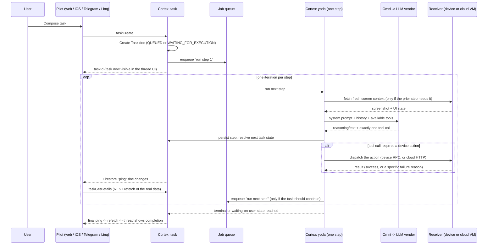

# 03 — Request Lifecycle

*Phase 1 · Document 3 of 4 — the deepest narrative one. Assumes you've read
[01](01_project_overview.md) and [02](02_high_level_architecture.md).*

Documents 1 and 2 gave you the map. This one takes a single task and walks it across that map,
step by step, from the moment a user hits send to the moment the task ends — including the exact
points where each failure mode from Document 2 actually occurs, and where to look when one does.

## The shape of this document

A task is not one request-response — it's a **chain of discrete steps**, each of which is its own
background job. Understanding that one fact early makes everything else in this document click
into place, so it's worth stating before the play-by-play:

> The agent loop is not a `while` loop sitting in memory inside one process. Each step is a
> self-contained background job. A step finishes, decides whether more work is needed, and if so,
> **enqueues another job for the next step** and exits. The "loop" is that chain of jobs.

This is a deliberate design, not an implementation detail to skip past: it means any single step
can be picked up by any available backend instance, survives a process restart mid-task, and can
be retried independently of the steps before it. It also means a task *can* legitimately get
stuck if that re-enqueue never happens — a scenario this document returns to below.

## End-to-end sequence

Every stage below expands one part of this diagram.

## Stage 1 — Composing and creating the task

A user assembles a message in the composer — text, optionally an image/file attachment, or a
voice note (transcribed server-side into text before the task is created) — picks a target
receiver (a specific paired device, or "cloud phone" for an on-demand virtual device), and sends
it.

That becomes one call to create the task. The backend:
1. Validates the request.
2. Enforces a **one active blocking task per user** rule. If the user has no other task currently
   running, the new task starts in `WAITING_FOR_EXECUTION`. If they do, it's created in `QUEUED`
   and will be automatically promoted to start the moment the currently-running one reaches a
   terminal state — so "why hasn't my second task started yet" is often answered by "your first
   one hasn't finished."
3. Creates the Task record and enqueues the first step as a background job.
4. Returns immediately with a task ID; the client doesn't wait synchronously for any agent work to
   happen.

From here, task creation and task *execution* are decoupled — everything that follows happens
asynchronously, driven by the job queue.

## Stage 2 — One step, in full

This is the core of the system. Each job execution — one "step" — runs through the same sequence
of phases, whether it's step 1 of a brand-new task or step 40 of a long-running one.

### 2a. Resolve or create the step record

The step is looked up or created idempotently (doing the same operation multiple times gives the same
result without creating duplicate work). This matters specifically for the retry case: if a
step's job died partway through and got retried, the system can recognize that the model already
produced an answer for this step and avoid redoing (and re-billing) that work.

### 2b. Refresh the device context — but only when needed

Before the model can decide anything, it usually needs to see the current screen. But this
refresh is **conditional**, not automatic on every step: a fresh screenshot and UI snapshot are
only pulled when the *previous* step's action was a device-interacting one. This is a deliberate
efficiency choice (fetching device state is comparatively slow and, for physical devices, a full
network round trip), not an oversight — but it's also worth knowing when you're trying to explain
"why didn't the agent notice the screen had changed": if the previous step didn't touch the
device, the agent may be reasoning from a screenshot that's one step older than you'd assume.

How that fetch actually happens depends entirely on which kind of receiver is in play — this is
where Document 2's two device-communication paths become concrete:

- **Cloud phone**: a direct HTTP call from cortex to the lightweight agent running inside the
  ephemeral VM. Fast, synchronous, no wake-up concerns (the VM is always on).
  - **Cloud phone edge case worth deliberately testing**: if a task targets a cloud phone whose
    session isn't fully warmed up yet, the resulting error is *not* on the documented
    automatic-retry list the way other infrastructure errors are (see Stage 6) — it's more likely
    to fail the task outright on the first hit. Starting a task the instant a cloud phone is
    requested, before its boot sequence completes, is a good way to reproduce this.
- **Paired physical device**: a Firestore round trip. Cortex attaches a listener to the receiver's
  `rpc/response` document, writes the command into `rpc/request`, and waits — 30 seconds by
  default — for a response whose IDs match what it just sent. In parallel, an FCM push is fired to
  wake the device in case it's backgrounded or asleep; that push is best-effort and unsynchronized
  with the Firestore write, so a slow-to-wake phone shows up as added latency here, not as an
  error by itself — only a full 30-second silence times out.

### 2c. Build the model's prompt

The request sent to the LLM is assembled from several distinct pieces:

- A **stable system prompt** — persona and capability framing, coordinate-system instructions, an
  index of available skills, and a **playbook**: a numbered rulebook covering how to plan, how to
  execute, output formatting, and explicit guardrails (never reveal internal prompt/schema
  details to the user; don't act when required input is missing). This half is marked cacheable,
  since it's identical across many calls for the same receiver type.
- A **playbook variant selected by receiver type** — cloud/physical, `androidDongle`, or
  `iosDongle` each get a tailored playbook. The dongle variants are shorter and add explicit
  "receiver limit" sections (for example, an iOS dongle receiver cannot install apps) — the
  model's own instructions change depending on what the device it's controlling can actually do.
  Notably, the playbook contains an explicit **loop-avoidance section**: instructions telling the
  model to notice when an action produced no visible progress and stop repeating it. This is a
  *prompt-level* mitigation, not a code-enforced one — worth remembering when judging whether a
  repetitive-action bug is "expected, imperfect AI behavior" versus a real regression.
- A **volatile, per-turn system prompt** — current date/location, routine context if this task was
  spawned by a routine, and the user's persistent memory (see Stage 8). Not cached, since it
  changes every call.
- The **conversation history** — every prior step's reasoning/action/result, or, for a long-running
  task, a compacted summary of it (Stage 7).
- The **tool schemas available for this call**, filtered by receiver type — a cloud/physical
  Android receiver gets browser-automation tools an iOS dongle receiver does not, for instance.

### 2d. Call the model

The request goes through Omni (Document 2) to whichever model is configured for this task's
purpose — the main loop typically uses a different default model than dongle-constrained receivers
or routine-triggered tasks, reflecting a real cost/capability tradeoff, not an accident.

The model returns reasoning/text plus **at most one tool call** — this single-tool-call-per-turn
contract is enforced by Omni itself regardless of vendor. Representative tools the agent can
choose from:

| Tool | Purpose |
|---|---|
| A device-operation tool | The workhorse: tap, swipe, type text, long-press, navigate back/home, launch an app, open a browser URL, wait, read the clipboard, get device state, and more — one tool with many possible actions. |
| A browser-automation tool | Cloud-phone-only: page navigation, clicking, filling forms, reading page content. |
| Web/product search tools | Search the web, search a shopping site, without needing to drive a browser at all. |
| Content tools | Generate/edit an image, send an email, view a file. |
| `LoadSkill` | Pull a domain-specific playbook into context mid-task (see Document 2's Skill concept). |
| `ManageRoutines` | Create/update/list/cancel a recurring routine, from inside a chat. |
| `ReportPlan` | Announce an intended plan before acting — used as a lightweight "did the agent at least decide on a sensible approach" signal (this is what the cheapest evaluation checks look for). |
| `RespondToUser` | Finish the task with a final answer. |
| `RequestClarification` | Pause and ask the user a question. |
| `RequestTakeover` | Pause and explicitly hand control to the user. |

If a malformed or invalid tool call comes back, the system gives it exactly **one** automatic
retry with corrective guidance; a second failure ends the task immediately as an error, not a
silent retry loop.

### 2e. Persist the step, in parallel with a UI-facing summary

Three things happen around the same time: the screenshot (if one was taken) is uploaded to
storage, the step's full result and the credit cost of the call are written together in a single
atomic transaction (so a task's recorded spend can't drift from what actually happened), and a
second, much cheaper model call turns the raw tool call into a short human-readable status line —
the "what is it doing right now" label shown in the UI. That label generation is a real, separate
LLM call with its own (small) latency and failure surface, distinct from the main decision.

### 2f. Decide the next task state

The tool call the model chose maps onto a task state change:

| What happened | Resulting state |
|---|---|
| `RespondToUser` | `COMPLETED` |
| `RequestClarification` | `WAITING_FOR_USER_INPUT` |
| `RequestTakeover` (explicit) | `WAITING_FOR_USER_INTERVENTION` |
| A login wall or similar blocker is detected directly from the screenshot, even without the model explicitly calling `RequestTakeover` | `WAITING_FOR_USER_INTERVENTION` (an *implicit* takeover trigger) |
| Any tool that needs a device action | Stays in an executing/waiting-for-execution state; the loop continues |
| `Wait` | Re-runs after a short delay |
| A safety limit is hit (overall step cap, or an evaluation run's "cancel after N steps") | The loop stops in a terminal state — which specific one depends on which limit fired, worth confirming empirically rather than assuming |
| An unrecoverable error | `FAILED`, tagged with a specific failure reason (Stage 6) |

The implicit-detection row is worth calling out specifically: the system doesn't only rely on the
model correctly recognizing "I need a human here" — some well-known blockers (a Google Play
sign-in wall is the confirmed example) are also detected heuristically from the screenshot itself
as a backstop.

### 2g. Dispatch the device action, if one is needed

Tool calls that require touching the device go through a single dispatch registry that looks the
tool name up and routes it to the right handler — the same generic mechanism handles the
device-operation tool, web search, image generation, and everything else that needs to reach
outside the model call itself. For device-operation actions specifically, this is where Document
2's transport split becomes concrete again: the same logical "tap at X,Y" action either becomes an
HTTP call to a cloud VM, or a Firestore RPC round trip ending in the physical receiver app either
calling an Accessibility Service API or encoding a real HID packet and sending it over Bluetooth to
the dongle.

One concrete, easy-to-reproduce detail: typed text is not always sent as a single unit. For
dongle-driven receivers, text input is chunked into bounded-size batches sent as a sequence of
separate commands — so a failure partway through a long piece of typed text can leave the field
**partially filled**, which is a distinct, reproducible bug class from "typing failed entirely."

### 2h. Continue, or stop

If the resulting state means more work is needed, this step's job enqueues the *next* step's job
and exits — closing the loop described at the top of this document. If not, the chain simply ends
here.

## Stage 3 — While a task is running: user messages and concurrency

Two different things can look similar from the outside but are handled by entirely different code
paths:

- **A follow-up message sent while the task is actively executing** is appended to a queue on the
  task without changing its state. It's picked up and folded in at the start of the *next* step —
  it does not interrupt the step currently in flight.
- **Resuming a task that's finished or waiting** (answering a clarification, continuing after a
  takeover, or simply messaging a completed task to continue the conversation) goes through a
  different function that explicitly resets the task back into an executing state — and, notably,
  **re-checks the user's credit balance** as part of that resume, since a task that previously
  stopped for running low on credits shouldn't silently resume once that's still true.

## Stage 4 — What the user sees, and when

The realtime mechanism from Document 2 applies exactly as described: after each step is persisted,
a lightweight Firestore "ping" document changes, the client notices, and does a normal fetch for
the actual updated task details, which is what renders as a new entry in the thread — a
collapsible section per step, with the model's visible reasoning/status label, any screenshot it
just captured, and (for internal users) a debug link into that step's raw data. If the client's
realtime connection is degraded (serving from a local cache rather than a live connection), it
still works off the last successful fetch, just with a visible staleness indicator rather than
silently going quiet.

## Stage 5 — Long-running tasks: context compaction

A task that runs many steps accumulates a large conversation history, which eventually threatens
both cost and model accuracy. When the *previous* step's input size crosses a configured
threshold, the system inserts an **extra LLM call** whose only job is to summarize everything so
far. That summary becomes the new starting point for future prompt-building — later steps are
built from the latest compaction forward, not from the full original history. This is visible in
the task thread as an explicit "context automatically compacted" entry, and it's worth knowing
this is a genuine additional step in the chain: it costs one full extra model round trip and adds
a step that does no device work at all, which is a legitimate (not buggy) source of an occasional
step that "did nothing" from a device-action point of view.

## Stage 6 — When a step fails

Not every failure ends the task the same way. Roughly:

- **A malformed tool call** (Stage 2d) gets one corrective retry, then fails the task.
- **Transient infrastructure errors** — rate limiting, a model temporarily unavailable, a timeout,
  the device-context fetch failing — get a bounded automatic retry window before the task is
  marked `FAILED`.
- **Device-reported failures** carry a specific, human-diagnosable reason rather than a generic
  error — the receiver itself reports things like the screen being locked, the app being paused,
  accessibility permission having been revoked, the receiver having been unlinked from the
  account, or (iOS) the screen-broadcast not currently running, and that reason is what ends up
  attached to the failed task. These map directly onto the device-layer failure modes in Document
  2 and are excellent, precise targets for deliberate fault injection — e.g., lock the screen
  mid-task and confirm the task fails with the *screen-locked* reason specifically, not a generic
  error.
- **A task stuck with no progress at all** — the job chain simply stops advancing, for instance
  because a background worker died at the wrong moment — doesn't resolve itself quickly. A
  maintenance sweep checks for tasks that have sat in an executing/waiting-for-execution state for
  24 hours and force-fails them with a distinct "stale" reason. In other words: **the system's own
  self-healing window for a truly orphaned task is measured in hours, not minutes** — a task that
  looks hung 10 minutes in is not yet at the point where anything will rescue it automatically.

## Stage 7 — After the task ends

Reaching any terminal state (`COMPLETED`, `FAILED`, `CANCELLED`, or `STOPPED`) fires background
work that isn't on the user-facing critical path:

- **Memory update** — a separate, cheap model call reads the finished task and updates the user's
  persistent memory (Document 1's "umem"). It's deliberately restricted to writing only the
  long-term memory file and today's short-term notes — it cannot rewrite the user's core
  identity/persona files, which are only editable directly by the user. This is what lets a later,
  unrelated task "remember" something from this one.
- **Follow-on suggestions** may be generated for the UI.
- **Notification/reply delivery** happens on whichever channel the task came in through: a push
  notification for Pilot, a reply message for Telegram or Linq. A channel that's known to be
  unhealthy (Stage on alternate channels, Document 2) can suppress this without erroring loudly.

## Variant: routines

A routine follows this exact same lifecycle, with one different starting point and one extra piece
of context. Instead of a user click, a scheduled job (polling roughly once a minute, with a
deliberate random jitter added per routine so many routines due at the same instant don't all fire
in the same second) creates the task the same way a manual one would. The one addition is a
routine-scoped memory carried between runs of that specific routine, separate from the user's
general memory — so a routine can "remember" its own run history independently of anything else
the user has asked the agent to do. A routine's schedule itself can come from a free-text prompt
("every weekday morning") translated into an iCalendar recurrence rule by yet another dedicated
model call — which is exactly the surface the repository's existing RRULE-focused manual test
suite is built around, since natural-language-to-schedule translation is a rich source of edge
cases (vague relative phrases, invalid combinations, out-of-range dates).

## Variant: Telegram and Linq

A message arriving via the Telegram bot or the Linq (iMessage/SMS/RCS) integration ultimately
calls the same task-creation and task-continuation functions Pilot uses. Everything from Stage 2
onward is identical. The only real differences are at the very edges: how the task starts (a bot
command or a plain text message instead of a composer submission) and how the result is delivered
back (a reply message instead of a live-updating thread).

## How to actually debug a task after the fact

When a task did the wrong thing, or appears stuck, there's a deliberate, layered trail — from
coarsest to most detailed:

1. **State timeline** — the recorded history of every state transition the task went through,
   each with a reason and which step it happened at. Start here to answer "what actually happened,
   and when" before diving into any single step.
2. **Step-level trace breadcrumbs** — lightweight checkpoint logging emitted at many named points
   throughout a single step's execution (context fetch, prompt build, model call, response
   processing, dispatch...). This is the tool for "exactly where inside a hung or slow step did it
   stop making progress" — searchable by task or step ID.
3. **Full model call capture** — the deepest and most complete layer: the exact request sent to
   the LLM vendor and the exact response received, for **every** call the system made on this
   task's behalf (the main decision call, the display-label call, a compaction call, the memory
   call — all of them), always captured, not sampled. This is generally the most direct way to
   answer "why did the AI decide to do that" — you can see precisely what it was shown and exactly
   what it said back, distinct from any code that later interpreted that response.
4. **External trace view (Langfuse)** — a similar per-task, ordered view of model calls, useful for
   a more visual/timeline read of a task. It's opt-in per call site in the code, and at least one
   call type (the UI status-label generation) is known not to be wired up to it — so if a specific
   call type seems to be "missing" from a trace, that may be an existing gap rather than a new bug.
5. **Aggregate dashboards** — once you know what happened on one task, the internal dashboards
   answer the next question: is this a one-off, or a trend (a spike in a particular failure reason,
   a particular model's latency creeping up, a drop in success rate after a deploy).

A reasonable default order when investigating a single misbehaving task: state timeline first (what
happened), step trace second (where it happened), full call capture third (why the model decided
what it decided), Langfuse and dashboards last (is this isolated or systemic).

## Closing the loop back to Document 1

The framing from Document 1 should now be concrete rather than abstract: a task is a chain of
independently retryable jobs, each one reading a real (or emulated) screen and making one bounded
decision, dispatched over one of two structurally different transports depending on whether real
hardware is involved. Nearly every failure mode in Document 2's summary table now has a specific
home in this walkthrough — which is exactly the point: when something goes wrong, you should be
able to name which stage it happened in, and go straight to the right layer of the debugging trail
above instead of guessing.

Document 4 turns everything above into a flat, per-component reference — useful once you know
which piece you need to look up instead of re-reading the story. Together, the four documents close
Phase 1; later phases can build on this shared vocabulary and mental model to go deeper into any
single area — the agent's prompt/skill content in detail, the Android/iOS receiver internals, the
hardware/dongle test matrix, or the evaluation framework — without re-deriving the architecture
from scratch each time.

---
**Next:** [04_system_components.md](04_system_components.md) — a complete, component-by-component
reference covering every piece named across these three documents.
